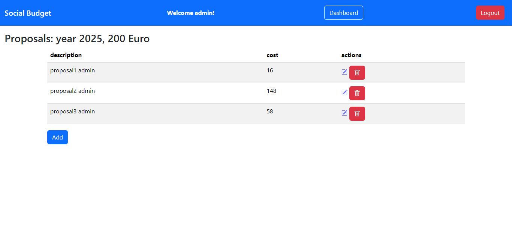
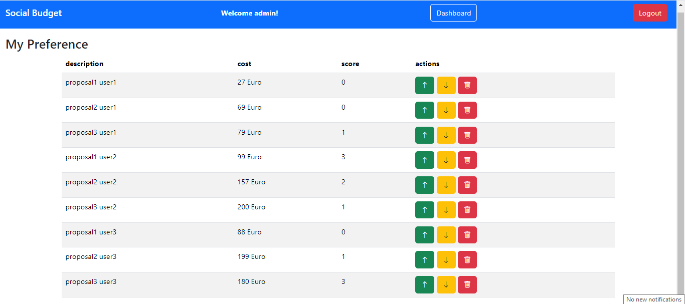

# Exam #2: "Social Budget"
## Student: s329141 ALIZADEH LEILA 

## React Client Application Routes

- Route `/`: `IndexPageComponent` - This page displays a message to anonymous users during phases 0-2. In phase 3, anonymous users see approved proposals. Logged-in users see buttons they can use to navigate to other pages.
- Route `/login`: `AuthComponents` -  Registered users enter their username and password. If the credentials are correct, they are directed to the main page.
- Route `/budget`: `BudgetComponents - BudgetLayout` - On this page, logged-in admin can view a defined budget, add a budget, change the phase with the "Next phase" button, and reset to phase 0. Other users do not have access to this page.
- Route `/budget/addBudget`: `BudgetComponents - AddEditBudgetLayout` - This page is used to define the budget. The fields include "Budget" and "Year," both of which are integers.
- Route `/proposals`: `ProposalComponent - ProposalsLayout` - On this page, logged-in users can view a list of their own proposals. During Phase 1, they have options to add, delete, or update proposals. In other phases, these actions are hidden, and users see a message indicating they cannot modify proposals at this phase.
- Route `/proposals/addProposal`: `ProposalComponent - AddEditProposalsLayout` - This page is used to create new proposals. Each user can add up to 3 proposals, provided that the phase is equal to 1. The fields include "Description" and "Cost."
- Route `/Proposals/editProposal/:proposalId`: `ProposalComponent - AddEditProposalsLayout` - This page is used to update proposal information. Users can edit proposals only if the phase equals 1.
- Route `/preferences`: `PreferenceComponent - PreferenceLayout` - This page displays a list of proposals from all users except the logged-in user during phase 3; in other phases, users see a message. Users can increase the score using the "arrow up" button and decrease it using the "arrow down" button. Decreasing the score to 0 or clicking the "trash" button removes their preference from the proposal.
- Route `/approvedProposals`: `ApprovedProposals - ApprovedLayout` - This page displays a list of approved and unapproved proposals for logged-in users.

## Main React Components

- `ApprovedTable` (in `ApprovedProposals.jsx`): This component is used to display the list of approved and unapproved proposals.
- `LoginForm` (in `AuthComponent.jsx`): This component displays the login form for entering the username and password.
- `BudgetTable` (in `BudgetComponents.jsx`): This component displays the budget information in a table format.
- `AddBudgetLayout` (in `BudgetComponents.jsx`): This component is used to add new budget.
- `ApprovedTable` (in `IndexPageComponent.jsx`): This component is used to display the list of approved proposals for anonymous users.
- `ProposalTable` (in `ProposalComponents.jsx`): This component displays the proposals list in a table format.
- `AddEditProposalLayout` (in `BudgetComponents.jsx`): This component is used to add or edit proposal.
- `PreferenceTable` (in `PreferenceComponents.jsx`): This component displays the preference list in a table format.

(only _main_ components, minor ones may be skipped)

## API Server

- POST `/api/sessions`: used for login
  - request parameters: None
  - request body: An object having as attributes: `{username: "admin", password: "admin"}`
  - response body content: A **User** object that represents the logged in user
  - return a 401 for incorrect username or password
- GET `/api/sessions/current`: get the information of the current logged in user - logged in user
  - request parameters: None
  - request body: None
  - response body content: A **User** object that represents the logged in user
  - return a 401 for not authorized users  
- DELETE `/api/sessions/current`: logout user 
  - request parameters: None
  - request body: None
  - response body content: Null  
- GET `/api/getPhase`: get the phase number - announymous 
  - request parameters: None
  - request body: None
  - response body content: `{"phase":1}` 
- GET `/api/getBudget`: get the details of the budget - admin
  - request parameters: None
  - request body: None
  - response body content: `[{"id":1,"budget":200,"phase":1,"year":2025}]` 
- POST `/api/addBudget`: add new record to the budget table - admin
  - request parameters: None
  - request body: `{budget: 200, year: 2025, phase: 1}`
  - response body content: Null
  - return a 402 if there is the record in the budget table
- PUT `/api/changePhase/:id`: update the row of the budget table - admin
  - request parameters: `id` an integer whose value is the id of the budget record
  - request body: `{phase: 2}`
  - response body content: Null
- DELETE `/api/reset`: clear all the data from preference, proposal and budget - admin
  - request parameters: None
  - request body: None
  - response body: Null
- POST `/api/addProposal`: add new records to the proposal table - logged in users
  - request parameters: None
  - request body: `{description: "proposal1 admin", cost: "200", userId: 2}`
  - response body: Null,
  - return a 402 if user insert more than 3 proposals.
  - return a 402 if user's proposal's costs is more than budget.
  - return a 402 if phase != 1 
- PUT `/api/editProposal/:id`: update the row of the proposal table - logged in users
  - request parameters: `id`
  - request body: `{description: "proposal1 admin", cost: "41", userId: 2}`
  - response body: Null
  - return a 402 if proposal not found.
  - return a 402 if user's proposal's costs is more than budget.
  - return a 402 if phase != 1 
- DELETE `/api/deleteProposal/:id` : delete the row of the proposal - logged in users
  - request parameters: `id`
  - request body: None
  - response body: Null
- GET `/api/userProposals/:id`: get the records of the proposals where user_id = id -  logged in users
  - request parameters: `id` current user id
  - request body: None
  - response body: `[{"id": 2,"user_id": "2","description": "proposal1 admin","cost": 17}]`
- GET `/api/othersProposals/:id`: get the records of the proposals with their scores where user_id != id -  logged in users
  - request parameters: `id` current user id
  - request body: None
  - response body: `[{"preference_id": 8,"proposal_id": 8,"description": "proposal1 user1","cost": 15,"score":3}]`
- POST `/api/addPreference` : add new record to the preference table - logged in users
  - request parameters: None
  - request body: `{preference_id: 0, proposal_id: 19, user_id: 5, score: 1}` for add
                  `{preference_id: 42, proposal_id: 19, user_id: 5, score: 0}` for edit
  - response body: Null
  - return 402 if the users try to add preference to their own proposal.
  - return 402 if the users try to modify the preference in the wrong phase.
  - return 404 if the proposal not found.
- DELETE `/api/deletePreference/:id` : delete new record from the preference table - logged in users
  - request parameters: `id` preference id
  - request body: None
  - response body: Null
  - return 402 if the users try to modify the preference in the wrong phase.
  - return 404 if the proposal not found.
- GET `/api/getApprovedProposals` : get the list of the approved and unapproved proposals - logged in users
  - request parameters: None
  - request body: None
  - response body: `[{"id": 21,"username": "admin","description": "proposal3 admin","cost": 58,"score": 4}`
- GET `/api/getJustApprovedProposals`: get the list of the approved proposals - announymous
  - request parameters: None
  - request body: None
  - response body: `[{"id": 21,"username": "admin","description": "proposal3 admin","cost": 58,"score": 4}`

## Database Tables

- Table `user` 
  Description: The user table stores the data of the users who wants to use the system and contains the following columns:

   | Columns   | DataType | Constraints                    | Description                                      |
   |-----------|----------|--------------------------------|--------------------------------------------------|
   | id        | INTEGER  | PRIMARY KEY, AUTOINCREMENT     | Unique identifier for each user                  |
   | username  | TEXT     | NOT NULL                       | The unique username of the user                  |
   | password  | TEXT     | NOT NULL                       | The user's password (hashed)                     |
   | salt      | TEXT     | NOT NULL                       | A unique salt for password hashing               |
   | isAdmin   | INTEGER  | NOT NULL                       | If the user has admin role, "isAdmin" is 1 else 0|

- Table `budget`
  Description: This table stores the record of the budget defined by admin and contains the following columns:

   | Columns   | DataType | Constraints                    | Description                                      |
   |-----------|----------|--------------------------------|--------------------------------------------------|
   | id        | INTEGER  | PRIMARY KEY, AUTOINCREMENT     | Unique identifier for each budget                |
   | budget    | INTEGER  | NOT NULL                       |                                                  |
   | phase     | INTEGER  | NOT NULL                       | CHECK("phase" IN (0,1,2,3))                      |
   | year      | INTEGER  | NOT NULL                       |                                                  |

- Table `proposal` - 
  Description: This table stores proposals defined by each user and contains the following columns:
    
   | Columns    | DataType | Constraints                    | Description                                      |
   |------------|----------|--------------------------------|--------------------------------------------------|
   | id         | INTEGER  | PRIMARY KEY, AUTOINCREMENT     | Unique identifier for each proposal              |
   | user_id    | INTEGER  | NOT NULL                       | FOREIGN KEY("user_id") REFERENCES "user"("id")   |
   | description| TEXT     | NOT NULL                       |                                                  |
   | cost       | INTEGER  | NOT NULL                       |                                                  |

- Table `preference` 
  Description: This table stores the scores that each user gives to each proposal and contains the following columns:
   
   | Columns    | DataType | Constraints                    | Description                                            |
   |------------|----------|--------------------------------|--------------------------------------------------------|
   | id         | INTEGER  | PRIMARY KEY, AUTOINCREMENT     | Unique identifier for each preference                  |
   | proposal_id| INTEGER  | NOT NULL                       | FOREIGN KEY("proposal_id") REFERENCES "proposal"("id") |
   | user_id    | TEXT     | NOT NULL                       | FOREIGN KEY("user_id") REFERENCES "user"("id")         |
   | score      | INTEGER  | NOT NULL                       | CHECK("score" IN (0, 1, 2, 3))                         |

## Screenshots

## Users Credentials

- admin, 123456 
- user1, 123456 
- user2, 123456 
- user3, 123456 
